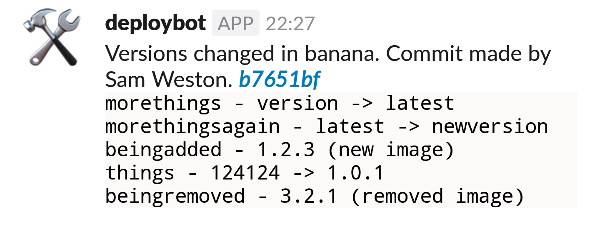

# helmfile Slack Bot
Takes the output of [helmfile](https://github.com/roboll/helmfile) or [helm-diff](https://github.com/databus23/helm-diff) as a text file and sends a reasonably nicely formatted message to Slack with any Docker version changes (other changes currently aren't shown).

This probably shouldn't be implemented in Bash but it seemed like a good idea at the time.*

\*May be a lie



## You will need
* One text file containing output from helmfile
* One Slack room for which you have permission to add a Bot to: https://my.slack.com/services/new/bot
* A Bash shell with standard tools like grep, awk, sed and cut

## Example Usage
```
helmfile -e myenvironment -f helmfile.yaml apply | tee testfile.txt
export slack_token=mysupersecrettoken
./bot.sh --diff-file testfile.txt --slack-channel bot-test --namespace banana --commit-url https://github.com/cablespaghetti/bigben/commit/
```

## Parameters
I'll get to this...

